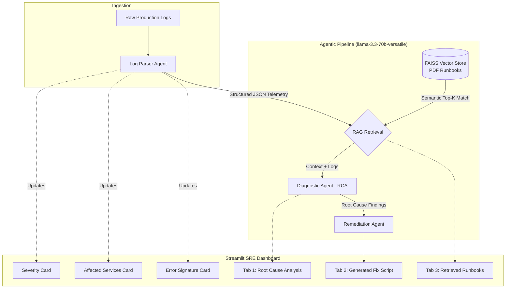

# OpsPulse AI ⚡
### Autonomous SRE Log Triage & Automated Root Cause Analysis

OpsPulse AI is an AI-powered Site Reliability Engineering (SRE) diagnostic platform designed to triage noisy distributed system logs, correlate cascading failures across microservices and databases, and synthesize automated Root Cause Analysis (RCA) and remediation hotfix scripts using **RAG-grounded Groq LLM agents**.

---

## 🏗️ Architecture & Pipeline Flow



---

## 📁 Project Structure

```
OpsPulse_AI/
├── .env                  # Groq API configuration
├── requirements.txt      # Python dependencies
├── rag_store.py          # FAISS vector store & SentenceTransformer indexing
├── agent_engine.py       # Groq LLM pipelines (Parser, Diagnostic, Remediation)
├── app.py                # Streamlit SRE diagnostic UI
├── README.md             # Project documentation
└── runbooks/
    └── sample_k8s_runbook.pdf  # Sample Kubernetes & PostgreSQL incident runbook
```

---

## 🚀 Key Features

1. **Structured Log Parser Agent**:
   - Analyzes raw stack traces, Nginx Ingress logs, and database errors.
   - Extracts structured incident telemetry (`error_signature`, `affected_services`, `severity`, `summary`).

2. **RAG-Grounded Runbook Vector Store (`rag_store.py`)**:
   - Embeds PDF runbooks using `sentence-transformers/all-MiniLM-L6-v2`.
   - Uses `faiss.IndexFlatIP` for rapid cosine similarity retrieval.
   - Returns matched troubleshooting procedures with source filenames, page numbers, and relevance scores.

3. **Autonomous Diagnostic Agent (RCA)**:
   - Deep reasoning via Groq (`llama-3.3-70b-versatile`).
   - Pinpoints primary root cause vs. cascading symptoms (e.g. database connection starvation causing Ingress 504 timeouts).

4. **Remediation & Hotfix Agent**:
   - Formulates immediate mitigation steps to stop downtime.
   - Generates executable, safe Bash/Python hotfix scripts ready to download and run.

5. **Streamlit SRE Command Console**:
   - Dynamic severity indicator cards and service badge chips.
   - Pre-loaded incident presets (PostgreSQL pool exhaustion, Ingress 504 timeouts).
   - Three synchronized diagnostic tabs for comprehensive incident review.

---

## 🛠️ Setup & Installation

### 1. Prerequisites
- Python 3.10+
- (Optional) [Groq API Key](https://console.groq.com/) for live LLM inference.

### 2. Environment Setup
```bash
# Clone or navigate into the project directory
cd OpsPulse_AI

# Create virtual environment
python -m venv .venv

# Activate virtual environment
# On Windows (PowerShell):
.venv\Scripts\Activate.ps1
# On Linux/macOS:
source .venv/bin/activate

# Install dependencies
pip install -r requirements.txt
```

### 3. Configure API Key
Edit `.env` or enter the key directly in the Streamlit sidebar:
```env
GROQ_API_KEY=gsk_your_actual_groq_api_key_here
```
> *Note: OpsPulse AI includes a high-fidelity offline simulation mode if a Groq key is not provided immediately.*

---

## 🖥️ Running the Application

```bash
streamlit run app.py
```

The application will open at `http://localhost:8501`.

1. Select a pre-loaded incident log preset or paste your own logs.
2. Click **🚀 Triage & Diagnose Incident**.
3. Inspect the side-by-side metric cards and explore the 3 analysis tabs.
